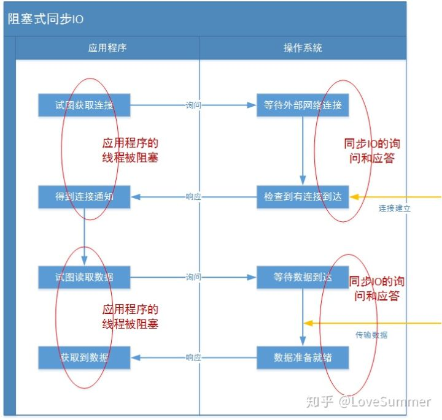
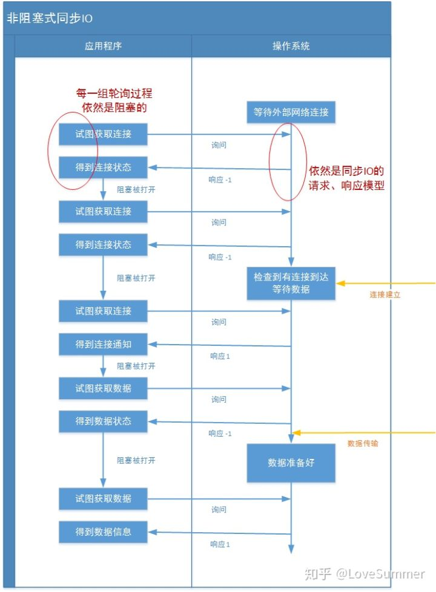
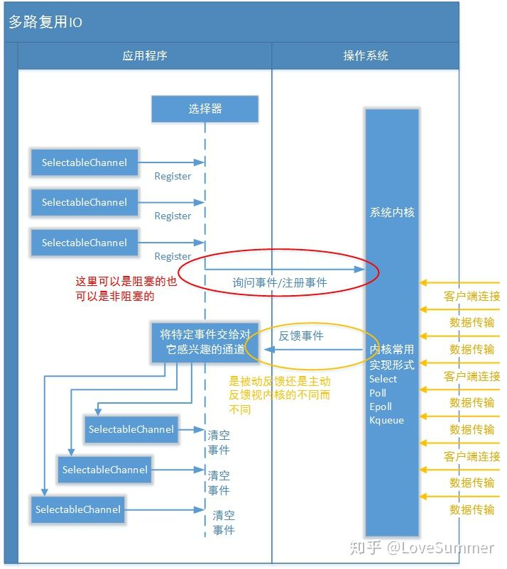
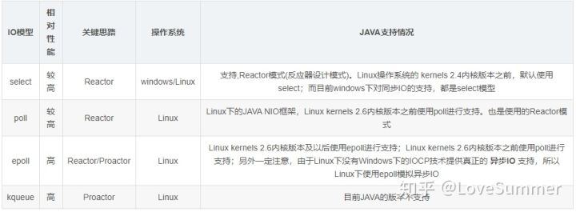
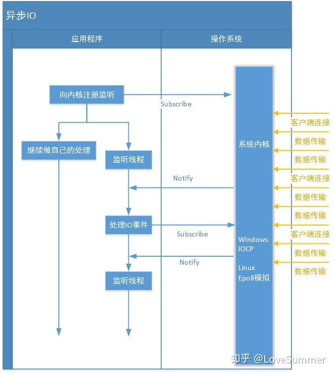

IO通讯模型主要包括阻塞式同步IO（BIO）、非阻塞式同步IO、多路复用IO以及异步IO

#### 阻塞式同步IO

应用程序向操作系统请求网络IO操作，这时应用程序会一直等待；另一方面，操作系统收到请求后，也会等待，直到网络上有数据传到监听端口；操作系统在收集数据后，会把数据发给应用程序，最后应用程序收到数据，并解除等待状态

#### 非阻塞式同步IO

应用程序的线程不再一直等待操作系统的IO状态，而是等待一段时间后，就解除阻塞。如果没有得到想要的结果，则再次进行相同的操作。这样的工作方式，暴增了应用程序的线程可以不会一直阻塞，而是可以进行一些其他工作

#### 多路复用IO（阻塞+非阻塞）

select、poll、epoll、kqueue

#### 异步IO

异步IO则是采用“订阅-通知”模式：即应用程序向操作系统注册IO监听，然后继续做自己的事请。当操作系统发生IO事件，并且准备好数据后，在主动通知应用程序，触发相应的函数

- 和同步IO一样，异步IO也是由操作系统进行支持的。微软的windows系统提供了一种异步IO技术：IOCP
- Linux下由于没有这种异步IO技术，所以使用的是epoll对异步IO进行模拟

### Java对IO模型的支持

- Java对阻塞式同步IO的支持主要是java.net包中的Socket套接字实现
- Java中非阻塞同步IO模式通过设置serverSocket.setSoTimeout(100);即可实现
- Java1.4中引入了NIO框架(java.nio)可以构建多路复用，同步非阻塞IO程序
- Java7对NIO进行了进一步改进，即NIO2，引入了异步非阻塞IO方式

#### TCP粘包/拆包

分别发送两个数据包D1和D2，可能出现的情况：

1. 分两次读取到了两个独立的数据包，没有粘包和拆包
2. 服务端一次接收到了两个数据包，D1和D2粘合在一起：TCP粘包
3. 分两次读取到了两个数据包，第一次读取到了完整的D1和D2部分，TCP拆包
4. D1一部分，D1剩余和D2完整

##### 解决思路

由于底层的TCP无法理解上层的业务数据，所以在底层是无法保证数据包不被拆分和重组的，这个问题只能通过上层的应用协议栈设计解决，根据业界的主流协议的解决方案，可以归纳如下：

- 消息定长，例如每个报文的大小为固定长度200字节，如果不够，空位补空格
- 在包尾增加回车换行符进行分割，例如FTP协议
- 将消息分为消息头和消息体，消息头中包含表示消息总长度的字段，设计思路为消息头的第一个字段使用int32来表示消息总长度
- 更复杂的应用层协议