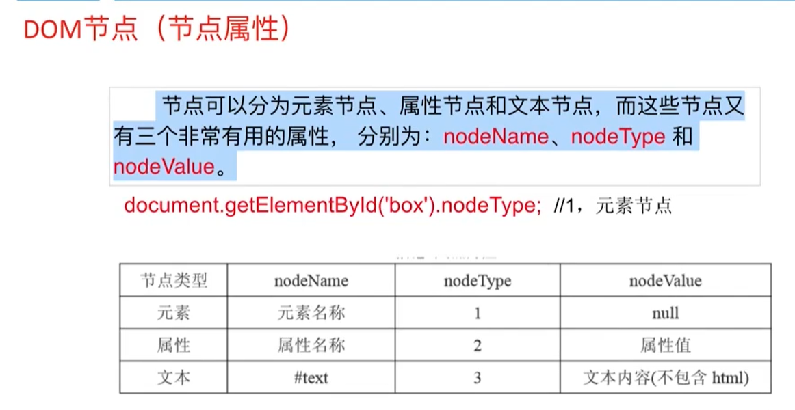

```
元素节点：
属性节点
文本节点
```

在JS中所有的节点都是对象

```javascript
var oDiv = document.getElementById();
oDiv.tagName;
```

object NodeList 装有当前元素节点所有的子节点

节点可以分为元素节点、属性节点和文本节点，而这些节点又有三个非常有用的属性，分别为：nodeName、nodeType和nodeValue

firstChild：快速找到当前元素节点子节点的第一个

lastChild：快速找到当前元素节点子节点的最后一个

