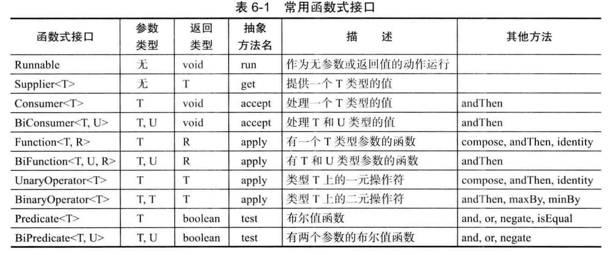

#### 6.3.1 为什么引入lambda表达式

lambda表达式是一个可传递的代码块，可以在以后执行一次或多次。

在Java中传递一个代码段并不容易，不能直接传递代码段。Java是一种面向对象语言，所以必须构造一个对象，这个对象的类需要有一个方法能包含所需的代码

#### 6.3.1 lambda表达式语法

```java
() -> {for(int i = 100; i >= 0; i--) System.out.println(i);}
```

如果可以推导出一个lambda表达式的参数类型，则可以忽略其类型

无需指定lambda表达式的返回类型。lambda表达式的返回类型总是会由上下文推导得出

#### 6.3.3  函数式接口

对于只有一个抽象方法的接口，需要这种接口的对象时，就可以提供一个lambda表达式。这种接口称为函数式接口。

对lambda表达式所能做的也只是能转换为函数式接口

BiFunction<T,U,R>，描述了参数类型为T和U而且返回类型为R的函数。

java.util.function.Predicate接口

```java
public interface Predicate<T> {
	boolean test(T t);
}
```

#### 6.3.4 方法引用

已有方法可以完成想要传递到其他代码的某个动作

```java
//方法引用
Timer t = new Timer(1000,event -> System.out.println(event));
Timer t = new Timer(1000,System.out::println);
```

要用 :: 操作符分割方法名与对象或类名。主要3中情况

- object::instanceMethod
- Class::staticMethod
- Class::instanceMethod

前两种，等价于提供方法参数的lambda表达式

```java
System.out::println =====  x -> System.out.println(x)
```

第三种，第一个参数会成为方法的目标

```java
String::compareToIgnoreCase ========= (x,y) -> x.compareToIgnoreCase(y)
```

#### 6.3.5 构造器引用

构造器引用与方法引用很类似，只不过方法名为new，具体调用那个构造器，取决于上下文

```java
ArrayList<String> names = ...;
Stream<Person> stream = names.stream().map(Person::new);
List<Person> people = stream.collect(Collectors.toList());
```

无法构建泛型类型T的数组

#### 6.3.6 变量作用域

三个部分

- 一个代码块
- 参数
- 自由变量的值，这是指非参数而且不在代码中定义的变量

如果在lambda表达式中改变变量，并发执行多个动作时就会不安全。也有可能在这变量在外部改变

在lambda表达式中声明与一个局部变量同名的参数或者局部变量是不合法的

#### 6.3.7 处理lambda表达式

延迟执行：

- 在一个单独的线程中运行代码
- 多次运行代码
- 在算法的适当位置运行代码
- 发生某种情况时执行代码
- 只在必要时才执行代码

