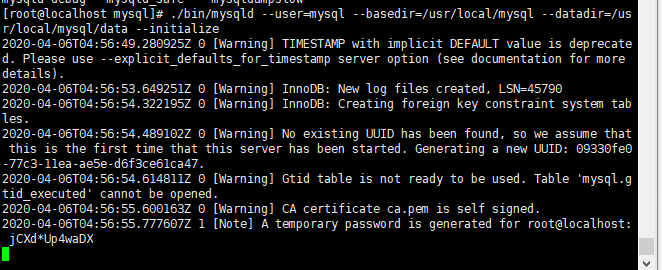

## 1.解压

```shell
tar -zxvf mysql-5.7.28-linux-glibc2.12-x86_64.tar.gz -C /usr/local/
```

## 2.重命名

```shell
mv mysql-5.7.28-linux-glibc2.12-x86_64/ mysql
```

## 3.添加mysql用户组和mysql用户

```shell
groupadd mysql
useradd -r -g mysql -s /bin/false mysql
```

## 4.进入mysql目录，修改当前目录拥有者为新建的mysql用户

```shell
chown -R mysql:mysql ./
```

## 5.安装MySQL

```shell
./bin/mysqld --user=mysql --basedir=/usr/local/mysql --datadir=/usr/local/mysql/data --initialize
```



```
初始密码： A temporary password is generated for root@localhost: jCXd*Up4waDX
```

## 6.编辑/etc/my.cnf

```shell

[mysqld]
port=3306
# 监听的地址
bind-address = 0.0.0.0
# 设置mysql的安装目录
basedir=/usr/local/mysql
# 数据目录
datadir=/usr/local/mysql/data
# socket通信设置
socket=/usr/local/mysql/mysql.sock
user=mysql
 
max_connections=151
 
federated
 
# Disabling symbolic-links is recommended to prevent assorted security risks
symbolic-links=0
 
# 设置忽略大小写
lower_case_table_names = 1
 
# 指定编码
character-set-server=utf8
 
collation-server=utf8_general_ci
 
 
# pid文件路径,需创建并授权，不建议手动设置
#pid-file=/var/run/mysqld/mysqld.pid
 
[mysqld_safe]
log-error=/var/log/mysqld.log
 
#指定客户端连接mysql时的socket通信文件路径
[client]
socket=/usr/local/mysql/mysql.sock
 
default-character-set=utf8
```

> 如出现“The server quit without updating PID file”
>
> 请检查/data pid等目录 是否存在与授权进行解决
> 日志文件目录/var/log

## 7.启动MySQL服务

```
./support-files/mysql.server start
```

## 8.将mysql命令设置为环境变量（/etc/profile）

```shell
export PATH=$PATH:/usr/local/mysql/bin
```

## 9.登陆

```mysql
mysql -uroot -p
```

## 10.修改密码

```mysql
alter user 'root'@'localhost' identified by 'liuxin1226';
flush privileges;
```

## 11.将MySQL进程放入系统进程中，开机自启

```shell
cp support-files/mysql.server /etc/init.d/mysqld
#授权
chmod +x /etc/init.d/mysqld
#添加服务
chkconfig --add mysqld
#显示服务列表
chkconfig --list
#执行
chkconfig --level 345 mysqld on
#重启
service mysqld restart
```

## 12.允许远程连接

```mysql
grant all privileges on *.* to 'root'@'%' identified by 'liuxin1226';
flush privileges;
```

