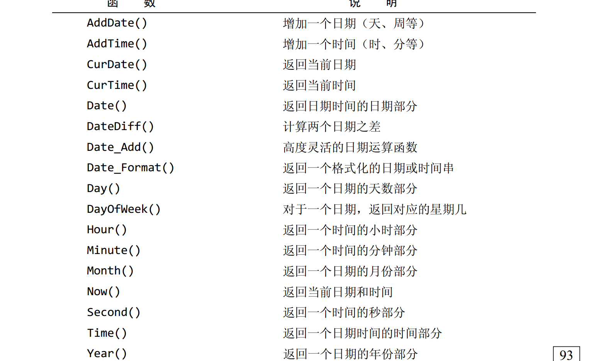

拼接字段：Concat()函数

```
CONCAT(vend_name, '(', vend_country, ')')
```

左右去空格：LTrim()、RTrim()

去掉两边空格：Trim()

转换大小写：UPPER() LOWER()



##### 存储过程

- 通过把处理封装在容易使用的单元中，简化复杂的操作
- 由于不要求反复建立一系列处理步骤，保证了数据的完整性
- 简化对变动的管理
- 提高性能
- 存在一些只能用在单个请求中的MySQL元素和特性，存储过程可以使用它们来编写功能更强更灵活的代码

简单、安全、高性能

执行存储过程的语句为Call

创建存储过程

```mysql
CREATE PROOCEDURE productpricing()
BEGIN
	SELECT AVG(prod_price) AS priceaverage
	FROM products;
END;
```

DELIMITER 定义新语句结束分隔符

##### 游标

游标是一个存储在MySQL服务器上的数据查询，不是一条SELECT语句，而是被该语句检索出来的结果集，在存储了游标之后，应用程序可以根据需要滚动或浏览其中的数据

游标主要用于交互式应用，其中用户需要滚动屏幕上的数据，并对数据进行浏览或做出更改

##### 触发器

- 唯一的触发器名
- 触发器关联的表
- 触发器应该响应的活动
- 触发器何时执行

```mysql
CREATE TRIGGER newproduct AFTER INSERT ON products
FOR EACH ROW SELECT 'Product added';
```

