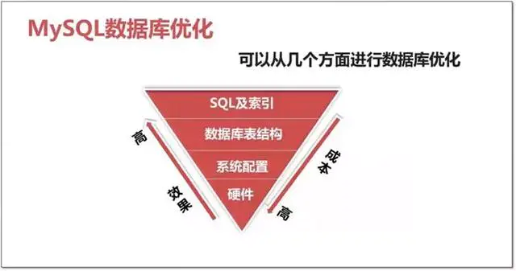

#### 影响：

- 优化不总是对一个单纯的环境进行，还很可能是一个复杂的已投产的系统
- 优化手段本来就有很大的风险，只不过你没能力意识到和预见到
- 任何的技术可以解决一个问题，但必然存在带来一个问题的风险
- 对于优化来说解决问题而带来的问题，控制在可接受的范围内才是有成果
- 保持现状或出现更差的情况都是失败

##### 优化的需求：

- 稳定性和业务可持续性，通常比性能更重要
- 优化不可避免涉及到变更，变更就有风险
- 优化使性能变好，维持和变差是等概率事件
- 切记优化，应该是各部门协同，共同参与的工作，任何单一部门都不能对数据库进行优化

