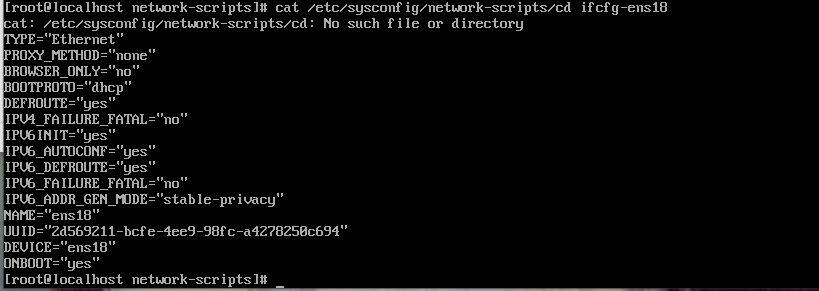

centos最小化安装没有ifconfig

```shell
ip addr	
```

```shell
cd /etc/sysconfig/network-scripts/
```

#### centOS7默认网卡信息及存放位置


#### 查看网卡配置信息



```shell
TYPE=Ethernet				# 网卡类型：为以太网
PROXY_METHOD=none			# 代理方式：关闭状态
BROWSER_ONLY=no				# 只是浏览器：否
BOOTPROTO=dhcp				# 网卡的引导协议：DHCP[中文名称: 动态主机配置协议]
DEFROUTE=yes				# 默认路由：是, 不明白的可以百度关键词 `默认路由` 
IPV4_FAILURE_FATAL=no		# 是不开启IPV4致命错误检测：否
IPV6INIT=yes				# IPV6是否自动初始化: 是[不会有任何影响, 现在还没用到IPV6]
IPV6_AUTOCONF=yes			# IPV6是否自动配置：是[不会有任何影响, 现在还没用到IPV6]
IPV6_DEFROUTE=yes			# IPV6是否可以为默认路由：是[不会有任何影响, 现在还没用到IPV6]
IPV6_FAILURE_FATAL=no		# 是不开启IPV6致命错误检测：否
IPV6_ADDR_GEN_MODE=stable-privacy			# IPV6地址生成模型：stable-privacy [这只一种生成IPV6的策略]
NAME=ens33					# 网卡物理设备名称
UUID=f47bde51-fa78-4f79-b68f-d5dd90cfc698	# 通用唯一识别码, 每一个网卡都会有, 不能重复, 否两台linux只有一台网卡可用
DEVICE=ens33					# 网卡设备名称, 必须和 `NAME` 值一样
ONBOOT=no						# 是否开机启动， 要想网卡开机就启动或通过 `systemctl restart network`控制网卡,必须设置为 `yes` 
```


#### 编辑网卡配置

```shell
#将网卡引导协议改为静态
BOOTPROTO=static
#设置网卡开机启动
ONBOOT=yes
#ip地址，网关，子网掩码，DNS设置
IPADDR=192.168.1.111
NETMASK=255.255.255.0
GATEWAY=192.168.1.1
DNS1=223.5.5.5
DNS2=8.8.8.8
```

保存退出

#### 重启网卡

```shell
systemctl restart network
```

