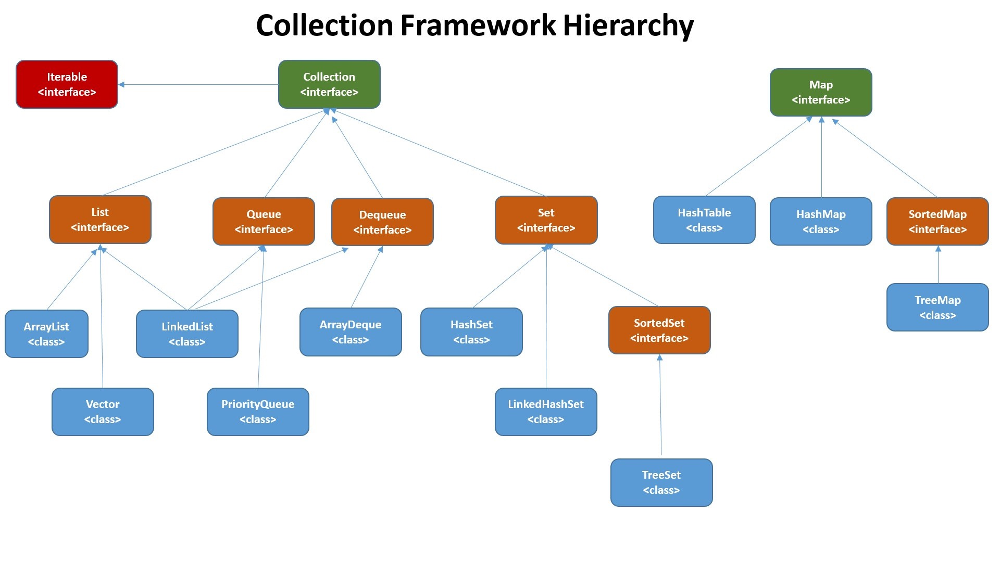

#### Java集合概览

#### List，Set，Map三者的区别

- List：存储的元素是有序的、可重复的
- Set：存储的元素是无序的、不可重复的
- Map：使用键值对存储，类似于数学上的函数，key是无序的、不可重复、value是无序，可重复的，每个键最多映射到一个值

#### 集合框架底层数据结构总结

##### List：

- ArrayList：Object[]数据
- Vector：Object[]数组
- LinkedList：双向链表

##### Set：

- HashSet（无序，唯一）：基于HashMap实现的，底层采用HashMap来保存元素
- LinkedHashSet：LinkedHashSet是HashSet的子类，并且其内部是通过LinkedHashMap来实现的
- TreeSet：（有序，唯一）：红黑树（自平衡的排序二叉树）

##### Map：

- HashMap：JDK1.8之前HashMap由数组+链表组成的

#### 如何选用集合

主要根据集合的特点来选用，比如我们需要根据键值获取到元素值时就选用Map接口下的集合，需要排序时选择TreeMap，不需要排序时就选择HashMap，需要保证线程安全就选用ConcurrentHashMap

当我们只需要存放元素值时，就选择实现Collection接口的集合，需要保证元素唯一时选择实现Set接口的集合比如TreeSet或HashSet，不需要就选择List接口的比如ArrayList或LinkedList，然后再根据实现这些接口的集合的特点来选用

