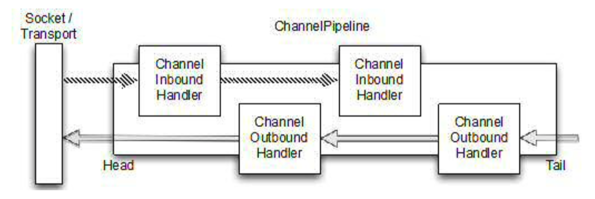

高可用、可扩展、性能高

使用NIO非阻塞式的IO模型等特点

两种方式：

1. 基于Callback
2. 基于Future

IO阻塞模型对于每一个Socket都会创建一个线程进行处理，虽然可以使用线程池解决线程过多的问题，但是底层还是使用线程处理每一个请求，系统的瓶颈在于现成的个数，并且线程多了会导致频繁的线程切换，导致CPU利用效率不高

NIO非阻塞模型采用Reactor模式，一个Reactor线程内部使用一个多路复用器Selector，可以同时注册、监听或轮询成百上千个Channel，一个IO线程可以同时并发处理多个客户端连接，就不会频繁的IO线程之间的切换，CPU利用率高

Netty解决了JDK的NIO 难用问题

##### Channel：

​	一个Channel表示一个通道，跟io中的stream的角色一样，担有以下不同：

1. stream是单向的，只支持读或者写，channel是双向的，既支持读也支持写
2. stream是阻塞的，channel是并行的

##### EventLoopGroup：

​	当一个Channel注册之后，会将这个channel绑定到EventLoop里来进行channel的IO操作，一个EventLoop对应一个线程

##### EventLoopGroup：

​	多个EventLoop的集合

##### ServerBootstrap：

​	用于配置服务端netty程序，比如绑定的port，EventLoop等

##### ChannelHandler：

​	用于处理关于Channel的业务逻辑。比如转换数据格式、当channel状态改变的时候被通知到，当channel注册到EventLoop的时候被通知到以及通知一些用户执行的特殊事件等

##### ChannelPipline：

​	把很多ChannelHandler整合到一起并进行处理

##### Future or ChannelFuture：

​	由于所有的netty都是异步操作，异步操作的结构就是ChannelFuture

------

ChannelInBoundHandler和ChannelOutBoundHandler是ChannelHandler的两种很常见的实现类，分别用于读取socket中的数据和写数据到socket中，存储在ChannelPipline中用于处理socket

------

transport：OIO、NIO、Local、Embedded

OIO：阻塞io模型

NIO：底层使用jdk的java.nio.channels包里的类，netty提供了2中nio的实现，分别基于selector和基于epoll的实现

Local：在同一个JVM中客户端与服务器进行通信的一种transport

Embedded：用于测试，可以在不需要网络的情况下进行ChannelHandler的单元测试

使用场景：

OIO：低连接数，低延迟，需要阻塞时使用

NIO：搞链接数

Local：同一个JVM中进行通信时使用

Embedded：ChannelHandler单元 测试时使用

------

netty中的ByteBuf的使用

ByteBuf来代替ByteBuffer，相比ByteBuffer，BuffBuf

1. 可以定义自己的buffer类型，比如heap buffer，direct buffer等
2. 可以使用内置的composite buffer类型完成零拷贝
3. buffer容量可以扩展
4. 不需要调用flip来切换读写模式
5. 区分readerIndex和writerIndex
6. 方法链式调用
7. 使用引用计数
8. 可以使用pool来创建buffer

