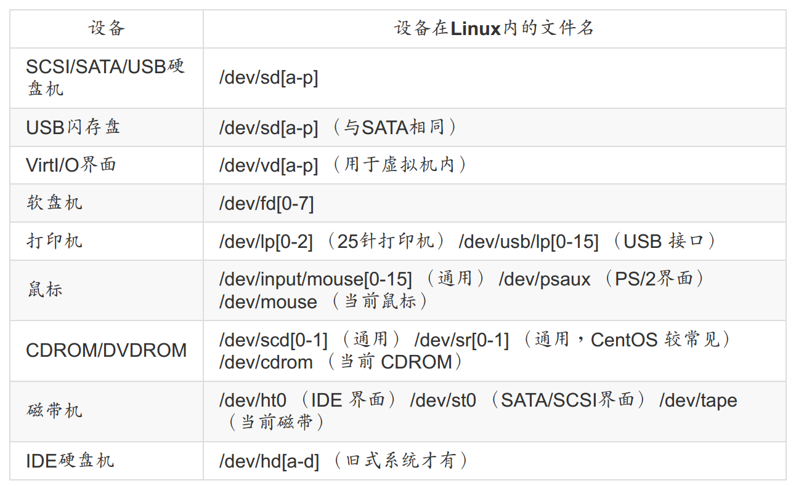
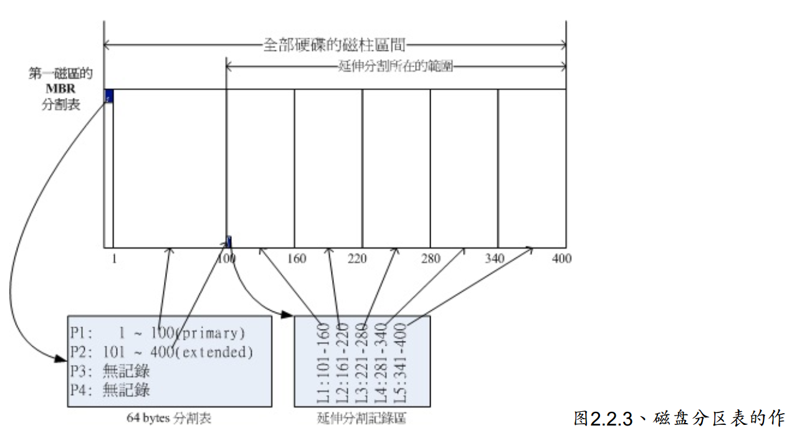
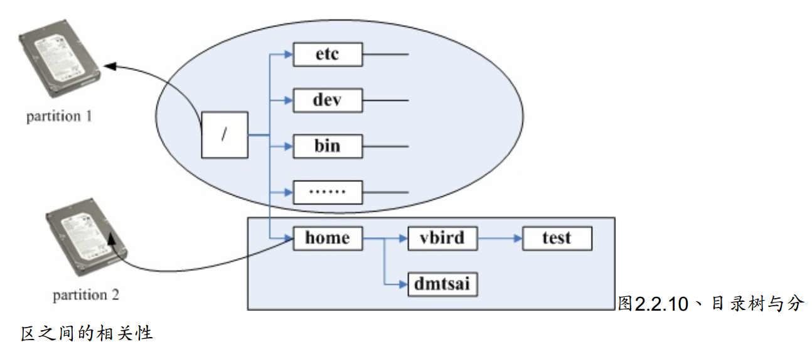
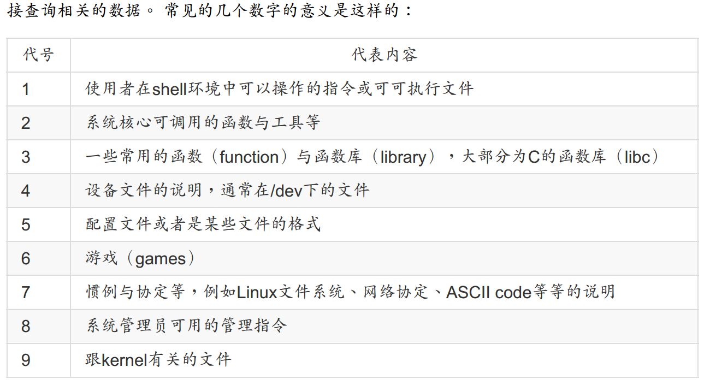
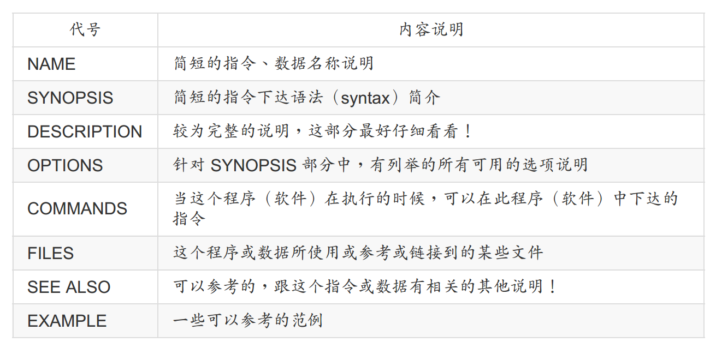

##### 分区：

- 分区只是针对64Bytes的分区表进行设置
- 硬盘默认的分区表仅能写入四组分区信息
- 主要与延伸分区
- 分区的最小单位通常是“柱面”
- 写入磁盘时，参考磁盘分区表，才能针对某个分区进行数据的处理

##### 为什么分区：

1. 数据的安全性
2. 系统的性能考虑

挂载

SWAP内存交换空间的功能是，当有数据被存放在实体内存里面，但是这些数据又不是常被CPU所取用时，那么这些不常被使用的程序将会被丢到硬盘的swap交换空间当中

