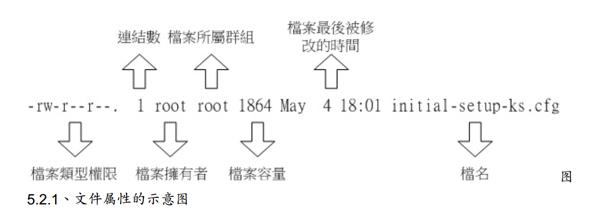
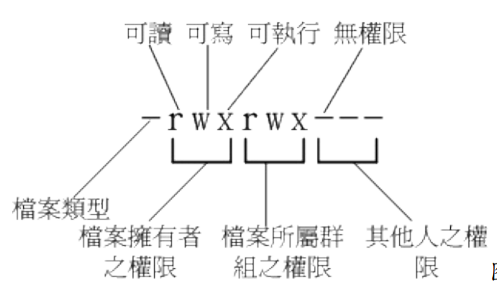
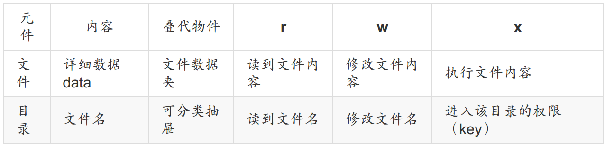
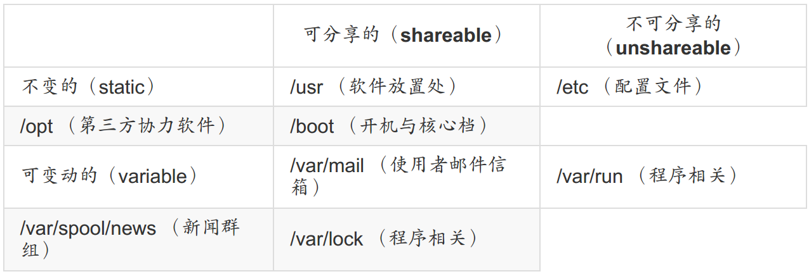
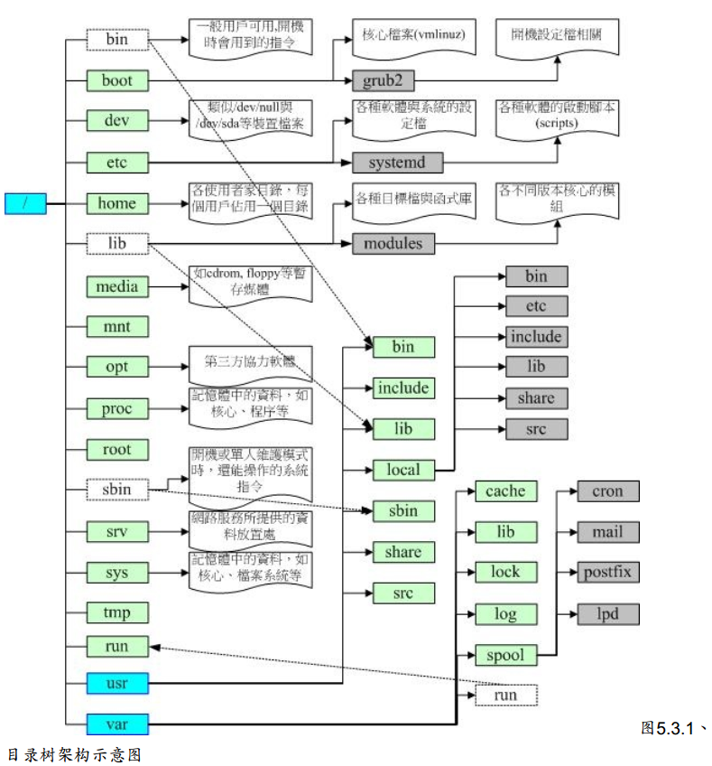

- d是目录
- -是文件
- I是链接文件
- b表示为设备文件里得可供储存得周边设备
- c表示设备文件里面得序列埠设备
- r可读
- w可写
- x可执行

##### 改变文件属性和权限

- chgrp:改变文件所属群组
- chown:改变文件拥有者
- chmod:改变文件的权限，SUID，SGID，SBIT等等的特性

r:4 》 w:2 > x:1

##### 文件类型

- 正规文件[-]
  - 纯文本文件
  - 二进制档
  - 数据格式文件
- 目录[d]
- 链接文件[l]
- 设备与设备文件
  - 区块设备文件
  - 字符设备文件
- 数据接口文件[s]
- 数据输送档[p]

##### 目录设置

- /:与开机系统有关
- /usr（unix software resource）:与软件安装/执行有关
- /var（variable）：与系统运行过程有关

##### 文件查阅

- cat由第一行开始显示文件内容
- tac从最后一行开始显示
- nl现实的时候，顺道输出行号
- more一页一页的显示文件内容
- less与more类似，但是比more更好的是，他可以往前翻页
- head只看头几行
- tail只看尾巴几行
- od以二进制的方式读取文件内容